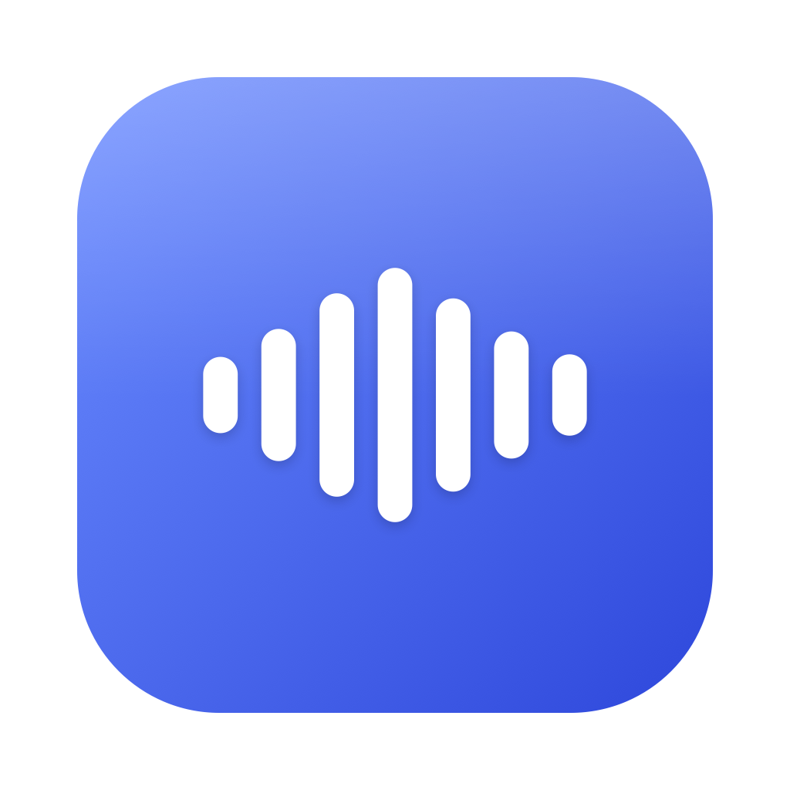
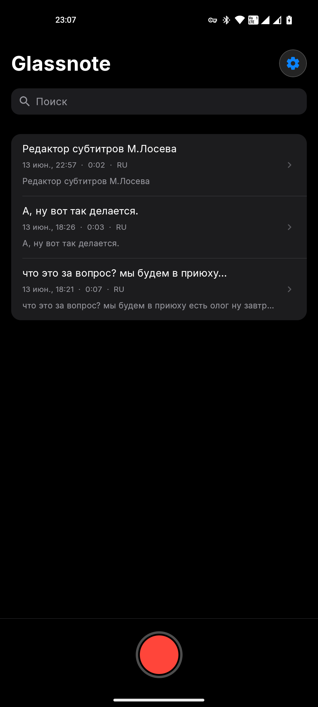

<div align="center">



# Glassnote для Android

**Голосовые заметки с локальной расшифровкой. Полностью офлайн, дизайн в стиле iOS.**

[](https://github.com/Arti-Ko/glassnote-android/releases/latest)
[](#)



</div>

## Что это

Glassnote записывает голос и превращает его в текст **на самом устройстве** — без интернета, без отправки аудио на серверы. Каждая заметка хранится как папка с аудио, расшифровкой и метаданными. Дизайн повторяет язык Apple (iOS 27 / Voice Memos): крупные заголовки, сгруппированные списки, шрифт Inter.

## Возможности

- 🎙 **Запись голоса** в один тап — кнопка как в Apple Voice Memos
- 🧠 **Локальная расшифровка** через [whisper.cpp](https://github.com/ggerganov/whisper.cpp) (модель `small-q5_1`)
- 🌍 **Языки** — русский, английский или автоопределение
- 🔒 **Полный офлайн** — аудио никогда не покидает телефон
- ⚡ **Плитка быстрых настроек** — старт/стоп записи прямо со шторки, даже с экрана блокировки, без открытия приложения
- 🔎 Поиск, правка расшифровки, копирование в Markdown
- 🎨 Светлая и тёмная тема (переключатель в настройках)
- 🔄 Проверка обновлений через GitHub Releases

## Как работает расшифровка

Аудио пишется в `m4a`, декодируется в PCM 16 кГц и обрабатывается нативной сборкой whisper.cpp (`arm64-v8a`, beam search). Модель (~190 МБ) скачивается один раз при первом запуске в приватную папку приложения.

## Установка

Скачайте `.apk` из [последнего релиза](https://github.com/Arti-Ko/glassnote-android/releases/latest) и установите (разрешите установку из неизвестных источников). Приложение само сообщит, когда выйдет новая версия.

## Сборка из исходников

```bash
git clone https://github.com/Arti-Ko/glassnote-android
cd glassnote-android
./gradlew :app:assembleDebug
# APK: app/build/outputs/apk/debug/app-debug.apk
```
Требуется Android SDK 34, NDK 26.3, CMake 3.22 (для нативной сборки whisper.cpp).

## Хранение заметок

```
Android/data/com.sleepycoffee.glassnote/files/Glassnote/<дата-время>/
├── audio.m4a        # запись
├── note.json        # метаданные + сегменты
└── transcript.md    # текст
```
Формат идентичен macOS-версии — заметки готовы к синхронизации.

## Технологии

Kotlin · Jetpack Compose · whisper.cpp (JNI/CMake/NDK) · MediaRecorder · Foreground Service · Quick Settings Tile

## Лицензии

Код — MIT. Шрифт [Inter](https://github.com/rsms/inter) — SIL OFL. whisper.cpp — MIT.

---

🖥 Версия для macOS: [Arti-Ko/glassnote](https://github.com/Arti-Ko/glassnote)
